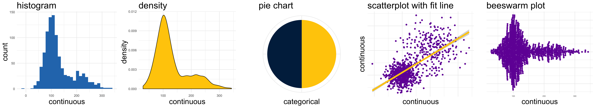

```{r setup, include=FALSE}

knitr::opts_chunk$set(echo = FALSE)

```

```{r}



```

# Course description

In an era of evidence based practice, community workers, advocates, and evaluators will likely find that they need to interpret and visualize data from a wide variety of sources. Understanding, interpreting and visualizing data (including some basic coding) can make the difference in successfully or unsuccessfully advocating for communities, clients or programs, and for understanding the impact of programs on clients. Increasingly, data relevant to community, participant and client well-being are available from a broad range of sources, whether those be databases of volunteers and donors, the Census, the World Bank, in addition to many others. <mark>This course will be focused on the acquisition of concrete applicable skills and strategies for interpreting and visualizing community data, including learning in R, Tableau and QGIS.</mark>

<aside>
```{r, fig.cap="Image Created By Royal Statistical Society"}


```
</aside>

> <mark>Some learning of basic coding in R will be involved in this course.</mark>

# Course content

Students will learn some of the major analytic and quantitative tools used by practitioners in assessing or evaluating human service programs or systems, which include a range of specific programs. The theme of this course is how to increase the rationality of the planning, analysis, and evaluation process, particularly of programs intended to serve the underprivileged or oppressed populations. Students will learn that human service organizations include a wide variety of programs of diverse size and complexity, with respect to their activities and goals. This course will impart skills which can be applied at various levels of analysis in different contexts.


