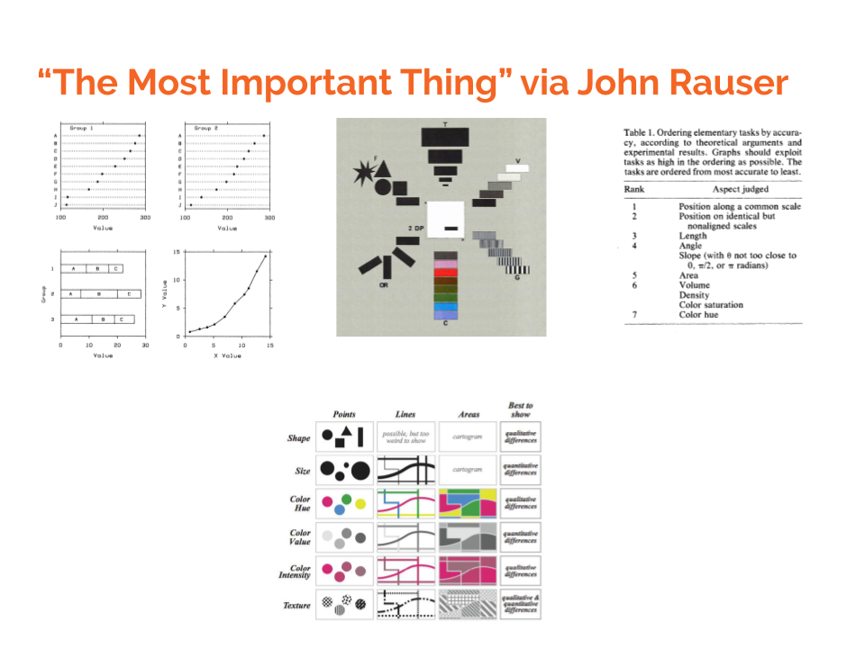

```{r setup, include=FALSE}

knitr::opts_chunk$set(echo = TRUE,
                      warning = FALSE,
                      message = FALSE,
                      fig.margin = TRUE)

library(ggplot2)

library(dplyr)

library(cowplot)

```

# Color 

## Color Model

[https://www.nceas.ucsb.edu/~frazier/RSpatialGuides/colorPaletteCheatsheet.pdf](https://www.nceas.ucsb.edu/~frazier/RSpatialGuides/colorPaletteCheatsheet.pdf)


```{r, echo=FALSE, webgl=TRUE}

# HSV Color Model

N <- 1000 # number of points

hue <- runif(N, 0 , 1) # hue

saturation <- runif(N, 0 , 1) # saturation

value <- runif(N, 0 , 1) # value

color <- hsv(h = hue, s = saturation, v = value)

plot(hue, 
     value, 
     col=color, 
     pch=19,
     main = "Draft Color Model Plot")

library(rgl) # 3D graphics

library(knitr) # explicit call to knitr

knit_hooks$set(webgl = hook_webgl) # "webhook"

plot3d(x = hue,
       y = saturation,
       z = value,
       col = color,
       size = 10,
       main = "Draft Interactive Color Model",
       phi = 90 + 45)

```

> R can use many different color models, but often uses a #**R**ed, **G**reen, **B**lue model with the amount of each color indicated in Hexadecimal, 00 to FF, notation.

## Three Types Of Palettes

[http://colorbrewer2.org/](http://colorbrewer2.org/)

```{r}

library(RColorBrewer)

```

```{r}

display.brewer.pal(7,"Set1") # qualitative

```

```{r}

display.brewer.pal(7,"YlOrRd") # sequential

```

```{r}

display.brewer.pal(7,"Spectral") # diverging

```

```{r, fig.margin = FALSE, fig.height=8}

display.brewer.all() # all palettes

```

\newpage

## Where Do The Colors in `ggplot` Come From?

Equally spaced around the color wheel.

{ width=20% }

```{r}

library(scales)

show_col(hue_pal()(4))

```

## Many Many Color Options

e.g. Viridis, which is designed to be *perceptually uniform*.

```{r, echo=FALSE, fig.cap="Viridis Palettes"}

library(ggplot2)

x <- seq(1,10) # sequence 1 to 10

p0 <- ggplot(data = NULL, 
       aes(x = x,
           fill = factor(x))) + 
  geom_bar() +
  guides(fill = FALSE) +
  theme_void()

plot_grid(p0 + scale_fill_viridis_d() +
            labs(title = "Viridis"),
          p0 + scale_fill_viridis_d(option = "magma") +
                        labs(title = "Magma"),
          p0 + scale_fill_viridis_d(option = "plasma") +
              labs(title = "Plasma"),
          p0 + scale_fill_viridis_d(option = "inferno") +
              labs(title = "Inferno"),
          p0 + scale_fill_viridis_d(option = "cividis") +
              labs(title = "Cividis"),
          ncol = 1)
          

```


# Fonts 

## Three Major Types of Fonts

* <font face="Arial">San Serif</font> e.g. Arial, Helvetica
* <font face="Times New Roman">Serif Fonts</font> e.g. <font face="Times New Roman">Times New Roman</font>
* `Monospaced Fonts` e.g. `Courier` (good for code).

## Font Rules

### <font face="Comic Sans MS">Don't</font> have `too many` <font face="Times New Roman">fonts!</font>

### Interesting Font For Heading; Standard Font For Text

<font face="Impact">Interesting Font for Heading</font>

Standard <font face="Arial">San Serif</font> or <font face="Times New Roman">Serif Fonts</font> for text. Lorem ipsum dolor sit amet, consectetur adipiscing elit, sed do eiusmod tempor incididunt ut labore et dolore magna aliqua. Ut enim ad minim veniam, quis nostrud exercitation ullamco laboris nisi ut aliquip ex ea commodo consequat. Duis aute irure dolor in reprehenderit in voluptate velit esse cillum dolore eu fugiat nulla pariatur. Excepteur sint occaecat cupidatat non proident, sunt in culpa qui officia deserunt mollit anim id est laborum.

# Cognition

## Dimensions of Data

> *Dimensions* of the Data, *Columns* of the Data, *Measures*, and *Questions* are all terms essentially pointing at the same concept.

```{r}

data(iris) # iris data set

library(DT) # nicely formatted data tables

datatable(iris) # dimensions of the data

```

Setosa: { width=20% } 
Versicolor: { width=20% } Virginica: { width=20% } 

> Iris species images courtesy [Wikipedia](https://www.wikipedia.org/).

```{r, fig.height=8, echo=FALSE}

p0<- ggplot(iris,
       aes(x = Petal.Length,
           y = Sepal.Length)) +
  geom_point() + 
  geom_smooth() +
  labs(title = "Minimal Philosophy",
       subtitle="Every Bit of Extra Ink Matters",
       caption = "Only two dimensions of data: No use of color.") 

p_minimal <- ggplot(iris,
       aes(x = Petal.Length,
           y = Sepal.Length,
           color = Species)) +
  geom_point() + 
  geom_smooth() +
  scale_color_viridis_d() + 
  labs(title = "Minimal Philosophy",
       subtitle="Every Bit of Extra Ink Matters",
       caption = "We only use color because \nwe have 3 dimensions of data.") 

p_maximal <- ggplot(iris,
       aes(x = Petal.Length,
           y = Sepal.Length,
           color = Species,
           shape = Species)) +
  geom_point(size = 2) + 
  geom_smooth() +
  scale_color_viridis_d() + 
  labs(title = "Maximal Philosophy",
       subtitle="Use Ink Liberally for Accessibility and Communication") +
  facet_wrap(~Species)

plot_grid(p0, p_minimal, p_maximal, nrow = 3)

```

## Some Geometries Are Easier To Understand Than Others



