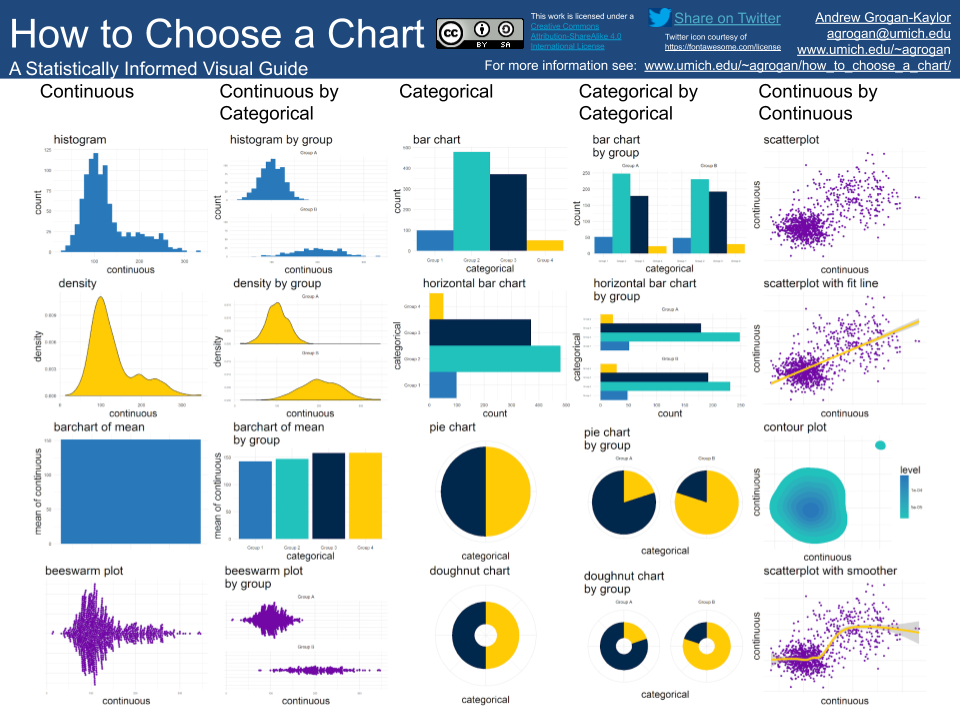

```{r setup, include=FALSE}

knitr::opts_chunk$set(echo = FALSE,
                      warning = FALSE,
                      message = FALSE,
                      fig.margin = TRUE)

library(tint)

library(tufte)

library(ggplot2)

library(ggthemes)

library(ggbeeswarm)

library(gapminder)

library(cowplot)

```

# <mark>Data Visualization for Political Social Work</mark> {data-background="colored-pencils.png"}

# How to Navigate This Presentation (scroll down &#8681;) 

## Navigation

* **o** for outline
* **f** for full screen
* **alt-click** for zoom

# Basic Considerations (scroll down &#8681;)

## The Nature of Your Variables Determines the Nature of Your DataViz

* Deciding upon the right data visualization to represent your data can be a daunting process.
* I believe that a *starting point* for this thinking is some basic statistical thinking about the *type* of variables that you have. 
* At the broadest level, variables may be conceptualized as *categorical* variables, or *continuous* variables.

## Variable Types

* *categorical variables* represent unordered categories like *neighborhood*, or *religious affiliation*, or *place of residence*.
* *continuous variables* represent a continuous scale like a *mental health scale*, or a *measure of life expectancy*.

## Visualization Possibilities

[How To Choose A Chart](http://www-personal.umich.edu/~agrogan/how_to_choose_a_chart/how_to_choose_a_chart_a_visual_guide.pdf)

{ width=50% } 

# Story-Telling (scroll down &#8681;)

## Your Graph Should Be A Self-Contained Story

```{r}

x <- rnorm(1000, 100, 10)

```

```{r, eval=TRUE, fig.margin = TRUE, fig.fullwidth = FALSE}

ggplot(data = NULL,
       aes(x = x,
           y = 1,
           color = x)) +
  geom_beeswarm(groupOnX = FALSE) +
  geom_label(aes(x = 120, 
                 y = 1, 
                 label = "possibly \ninformative \nkey takeaway"),
             size = 2, 
             color = "red") +
  scale_color_viridis_c(name = "some other \npiece of \ninformation",) +
  ylab("possibly another dimension of the data") +
  xlab("one dimension of the data") +
  labs(title = "Informative Title",
       subtitle = "Maybe The Title Is Even Your Main Takeaway",
       caption = "Every extra 'dimension' (x axis, y axis, color, shape) 
       should convey information.
       \n Words should be spelled out.") + 
  theme_minimal()

```


## Your Graph Should Be Embedded In A Story

{ width=25% } { width=25% } { width=25% }

# Color (scroll down &#8681;)

```{r}

data(gapminder)

p0 <- ggplot(gapminder,
            aes(x = continent,
                y = lifeExp)) +
  labs(title = "Life Expectancy Differs Across Continents",
       x = "Continent",
       y = "Life Expectancy",
       caption = "Source: Gapminder Data Set") +
  theme_minimal()

```

## Greyscale Graph

```{r}

p0 + stat_summary(fun.y = mean, geom="bar")

```


## Color is Organizational Identity

```{r}

p0 + stat_summary(fun.y = mean, 
                  geom="bar", 
                  fill = "lightblue")

```


## Color Is Information

```{r}

p0 + stat_summary(aes(fill = continent),
                  fun.y = mean, 
                  geom="bar")

```


## Color Is Accessibility

```{r}

p0 + 
  stat_summary(aes(fill = continent),
               fun.y = mean, 
               geom="bar") +
  scale_fill_colorblind()

```

## <mark>Color Is Emphasis</mark>

```{r}

p0 + 
  stat_summary(aes(fill = continent == "Africa"),
               fun.y = mean, 
               geom="bar") +
  scale_fill_manual(name = "Continent",
                     values = c("grey", "red"),
                     labels = c("Other Continents",
                                "Africa"))

```


# Cognition (scroll down &#8681;)

## "Graphical Perception"

"Ordering elementary tasks by accuracy [@Cleveland1985]:"

1. Position along a common scale
2. Position on identical but nonaligned scales
3. Length
4. Angle & Slope
5. Area
6. Volume, Density, Color Saturation
7. Color Hue

## Example (Position Along A Common Scale)

```{r}

p1 <- ggplot(gapminder,
             aes(x = continent,
                 y = lifeExp,
                 fill = continent,
                 color = continent)) +
  coord_flip() +
  labs(title = "Life Expectancy",
       subtitle = "by Continent",
       y = "Life Expectancy")

p1A <- p1 + stat_summary(fun.y = mean, geom="point")

p1B <- p1 + stat_summary(fun.y = mean, geom="bar")

p2 <- ggplot(gapminder,
              aes(x = gdpPercap,
                  y = lifeExp)) +
  geom_point() +
  geom_smooth() +
  labs(title = "Life Expectancy Differs by GDP",
       x = "GDP",
       y = "Life Expectancy",
       caption = "Source: Gapminder")

```

```{r}

p1A

```

## Example (Length)

```{r}

p1B

```

## Example (Angle)

```{r}

p2

```

# Questions? (scroll down &#8681;)

## Please Contact

[agrogan@umich.edu](agrogan@umich.edu)

[www.umich.edu/~agrogan](www.umich.edu/~agrogan)

[agrogan1.github.io](agrogan1.github.io)

## References


