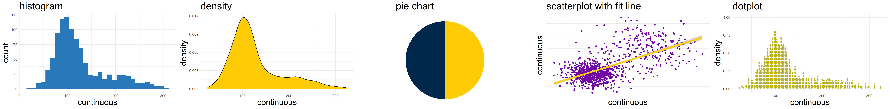

```{css, echo=FALSE}

@import url('https://fonts.googleapis.com/css2?family=Montserrat&display=swap');
.title-slide { 
  color: #ffcb05;
  background-color: #00274C; 
}
.title-slide h1 {
    color: #ffcb05;
}
pre {
  white-space: pre-wrap;
}
h1, h2, h3 {
  font-family: 'Montserrat', sans-serif;
}
body { 
    font-family: 'Montserrat', sans-serif;
}
.author, .date {
  font-family: 'Montserrat', sans-serif;
}

```

```{r setup, include = F}

# This is the recommended set up for flipbooks
# you might think about setting cache to TRUE as you gain practice --- building flipbooks from scracth can be time consuming

knitr::opts_chunk$set(fig.width = 6, 
                      message = FALSE, 
                      warning = FALSE, 
                      comment = "", 
                      cache = FALSE, 
                      fig.retina = 3)

library(flipbookr)

library(tidyverse)

library(xaringanExtra)

xaringanExtra::use_tile_view()

xaringanExtra::use_slide_tone()

xaringanExtra::use_share_again()


```

# Introduction

There are many different kinds of data visualization. In the language of the `ggplot` package for R, there are many different kinds of `geom`etries that we can apply to data.

```{r, fig.cap="Multiple Geometries for Data Visualization", echo=FALSE, fig.height=1}



```

However, after a number of years of working on data visualization, I have started to think about the advantages of bar graphs. While *not every visualization needs to be a bar graph*, it sometimes seems as though many data visualizations *would work well as a bar graph*.

In this slide deck, I use the `ggplot` package to develop bar graphs with `geom_col`, one of the bar graph `geom`etries. After building a basic bar graph, I apply many formatting ideas, most of which I have learned from the blog of Cedric Scherer ([https://www.cedricscherer.com/](https://www.cedricscherer.com/)).

---
class: animated, slideInRight
# Simulate Some Data

```{r}

group <- c("A", "B", "C") # group variable

mycount <- c(10, 20, 50) # count in each group

mydata <- data.frame(group, mycount) # make a data frame

mydata # replay

```

---
class: animated, slideInRight
# Call The Library

```{r}

library(ggplot2) # call the library

```

---
class: animated, slideInRight
# Set Up The "Logic" Of The Plot

```{r}

p0 <- ggplot(mydata, # the data I am using
       aes(x = group, # x is the group
           y = mycount)) # y is the count in each group
```

---
class: animated, slideInRight
# Basic Column Plot

```{r, fig.height=4}

p0 + # basic plot
  geom_col() # columns

```

---
class: animated, slideInRight
# Column Plot With Tweaks...

```{r graph2, include = FALSE, fig.height=4}

p0 + # basic plot
  geom_col(aes(fill = group)) + # columns w/ color fill for group
  coord_flip() + # flip the plot
  labs(title = "Group C Has The Most People", # informative title
       x = "Group", # better axis labels
       y = "Count") + 
  scale_fill_viridis_d() + # better color fill scale
  theme_minimal() + # better theme
  geom_label(aes(label = group, # label the bars
                 y = 5), # position the labels
             size = 10) + 
  theme(legend.position = "none") + # turn off legend
  theme(title = element_text(size = rel(2))) + # bigger title text
  theme(axis.text = element_text(size = rel(2))) # bigger axis text


```

---

```{r, code = knitr::knit_code$get("graph2"), eval = FALSE, echo = FALSE}
```

`r chunk_reveal("graph2", break_type = "auto", widths = c(4,2))`


